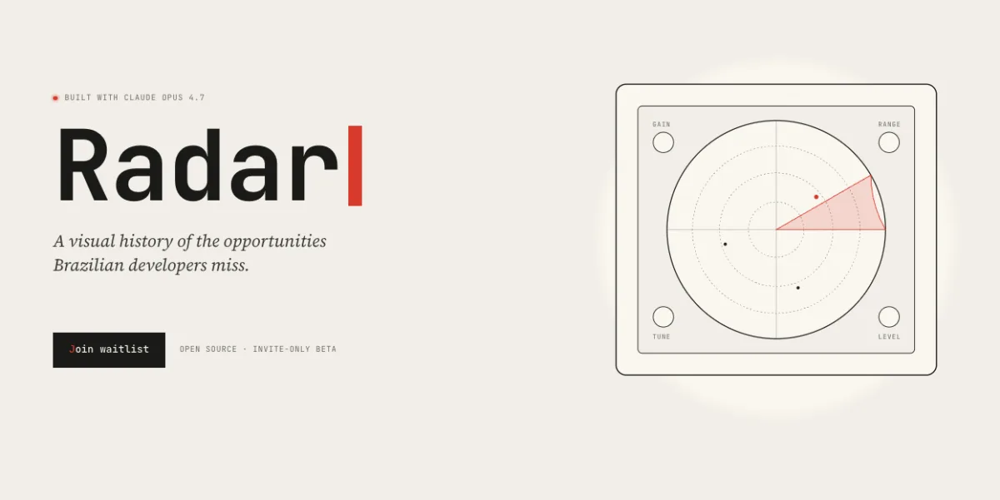

# Radar



> A career-plan platform for Brazilian developers. Three Claude Opus 4.7
> Managed Agents read you, crawl the world, and write a personal 90-day
> plan around the grants, fellowships, and bolsas you didn't know existed,
> and didn't know you'd be a fit for.

**Live demo:** [radar.pabloaa.com](https://radar.pabloaa.com)
**Demo video (3 min):** https://youtu.be/ueLPzXevysQ
**License:** AGPL-3.0
**Built for:** Cerebral Valley *Built with Opus 4.7* hackathon, April 2026

## The 2-in-500 problem

Of the ~500 developers approved for this hackathon, only 2 are Brazilian. The same ratio shows up across fellowships, grants, and accelerators. Brazil has over a million developers. The talent isn't missing. It's unmapped.

I opened a waitlist this week. Fifty Brazilian developers signed up in five days. I sat down with five of them. Different stages, same gap: an undergraduate with published research and mentors who couldn't name a single fellowship he was a strong fit for; a senior mid-career engineer looking for what's next; a junior dev who got her first job through a referral and had never heard of any of this. Not "I don't know what exists", but "I don't know what I'd be a fit for".

Brazil doesn't have a brain drain. It has an information drain. Radar finds the opportunity, and finds the person.

## Why I built it

I went to Japan twice through METI, the Ministry of Economy, Trade and Industry. I won a grant that put me at Harvard and MIT for an immersion last year. None of it came from a system. I found each opportunity by chance. Every day, on a community of about 60k Brazilian developers I run on Instagram ([@pablo_aa](https://instagram.com/pablo_aa)), the same DM lands: *"where do you find these things?"*. Radar turns that DM into a product.

## What it does

Three composed Anthropic Managed Agents:

1. **Anamnesis** reads your GitHub, an optional CV, and a personal site URL. It builds a structured profile plus a rich editorial self-portrait: archetype, peer constellation, year-shape, three-year vectors, recommended readings.
2. **Scout** is one shared long-running Managed Agent session that crawls 1,240+ curated sources weekly (FAPESP, Emergent Ventures, Chevening, MEXT, Y Combinator, Fundação Estudar, GSoC, MATS, ...) and persists structured opportunities to Supabase. At every run it discovers and queues 2-5 adjacent sources for the next pass.
3. **Strategist** runs per user, applies eliminatory clarify-answer filters (relocation appetite, time budget, study appetite, ambition vector), ranks opportunities against the profile, writes a *why-you* paragraph that cites specific profile fields, and produces a 90-day plan tied to each card.

All three use the Anthropic Managed Agents API (beta) with sessions reused across runs, custom tools (`render_card`, `query_opps`, `upsert_opportunity`, `fetch_github_profile`), streaming 32k-token outputs, and per-user memory.

## Architecture

See [`docs/02-architecture.md`](docs/02-architecture.md) for the data model and component picture, and [`docs/03-managed-agents-deep-dive.md`](docs/03-managed-agents-deep-dive.md) for the design decisions behind the Managed Agents composition.

## Repo layout

```
radar/
├── src/               Next.js 16 App Router, landing + auth + agent UIs
├── public/            static assets
├── supabase/          schema migrations and config
├── scripts/           CLI tooling (Anamnesis, Scout, Strategist setup)
├── data/sample/       fake profiles for tests and public demos
└── docs/              product brief, architecture, managed agents deep-dive
```

## What's shipped

- Production deployment at radar.pabloaa.com
- GitHub OAuth via Supabase, RLS policies per table
- Anamnesis end-to-end with PDF CV ingestion, streaming 32k outputs, defensive JSON parsing
- Scout running on a GitHub Actions cron, single-source protocol with discovery mandate, 1,240+ sources indexed
- Strategist with 4-section output (dated, recurrent, rolling, arenas) plus 90-day plan, eliminatory clarify-answer filters, and BR institutional context (MEI/PJ, FAPESP, USD-BRL conversion)
- Resend email notifications when agent runs complete
- Pre-commit hook blocking secret leaks (sk-ant, ghp_, JWT shapes)
- Rule-based scoring fallback when Strategist errors

## Non-goals

- **Not a job board.** LinkedIn and the established job aggregators already solve that. Radar's universe is grants, fellowships, bolsas, accelerators, OSS funding, bounties, and exchange programs.
- **Not auto-apply.** Radar surfaces, explains, and strategizes. Applying is always the user's decision.
- **Not resume optimization.** Dozens of tools do that already.

## License

AGPL-3.0-or-later. Any hosted fork must share its source under the same license.

## Contact

[pabloaa.com](https://www.pabloaa.com) · [@pablo_aa](https://instagram.com/pablo_aa) · contato@pabloaa.com
